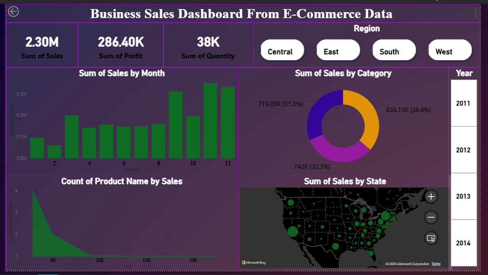

# FUTURE_DS_01
# 🛒 Business Sales Dashboard from E-Commerce Data

## 📊 Project Overview

This project showcases a dynamic and interactive **Business Sales Dashboard** built using **Power BI**, focused on extracting actionable insights from e-commerce transactional data. The dashboard provides a complete picture of sales performance, high-revenue categories, seasonal trends, and regional distribution—empowering business users to make data-driven decisions.

> 🚀 Built by: **Prince Bhadauria**  
> 📁 Dataset Used: `superstore.xls`

---

## 🎯 Objective

To analyze sales and product data from an e-commerce business and visualize the following key metrics:

- 🔝 Best-selling products
- 📈 Monthly and yearly sales trends
- 💼 High-revenue product categories
- 🌍 Sales distribution by region and state
- 📦 Total profit and quantity sold

---

## 🛠️ Tools & Technologies

- **Power BI Desktop**
- **Power Query Editor**
- **DAX (Data Analysis Expressions)**
- **Excel (initial data format)**

---

## 📌 Features of the Dashboard

- 📅 **Sales by Month** – Unveils seasonal trends across the year.
- 📦 **Sales by Category** – Highlights top-performing product categories.
- 🌍 **Sales by State (Map)** – Shows geographic performance.
- 🧮 **Key Metrics Cards** – Sales, Profit, Quantity at a glance.
- 🧾 **Top Products** – Based on sales volume.
- 📍 **Interactive Filters** – Region and Year slicers to explore specific views.

---

## 📚 Skills Demonstrated

- Data Cleaning & Transformation using Power Query
- Data Modeling and Relationships
- Writing Custom DAX Measures
- KPI Analysis & Trend Visualization
- Business Storytelling through Visual Design
- Dashboard Publishing & Documentation

---

## 📷 Dashboard Snapshot

---

## 📁 Files Included

- `superstore.xls` – E-commerce dataset
- `.pbix` – Power BI dashboard file
- `Bussiness_sales_dashboard_by_Prince.png` – Dashboard preview image
- `README.md` – Project documentation

---

## 📈 Key Insights

- 📌 **Total Sales:** ₹2.30M
- 📌 **Total Profit:** ₹286.4K
- 📌 **Top Category:** Office Supplies (36.4%)
- 📌 **Peak Sales Month:** December
- 📌 **Top Performing Region:** East & Central

---

## 📬 Contact

**Prince Bhadauria**  
🎓 MCA Student | Data Analyst Intern  
📧 princebhadauria207@gmail.com
🔗 www.linkedin.com/in/princebhadauria9837

